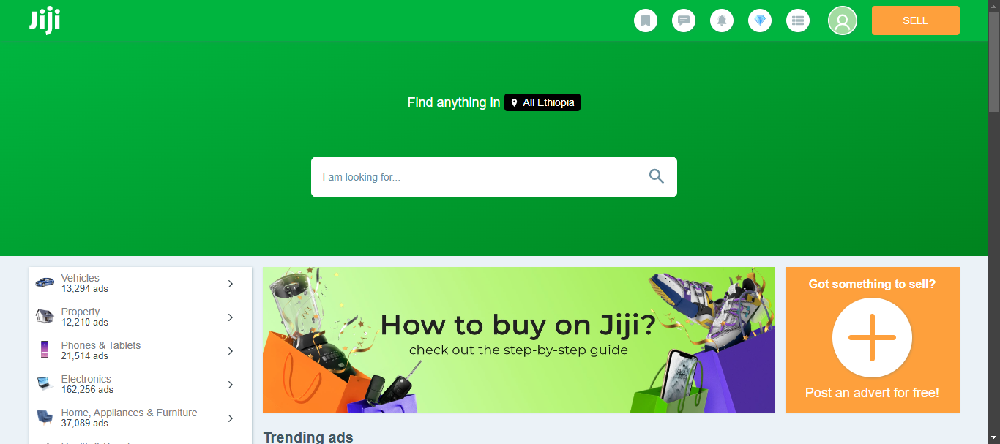
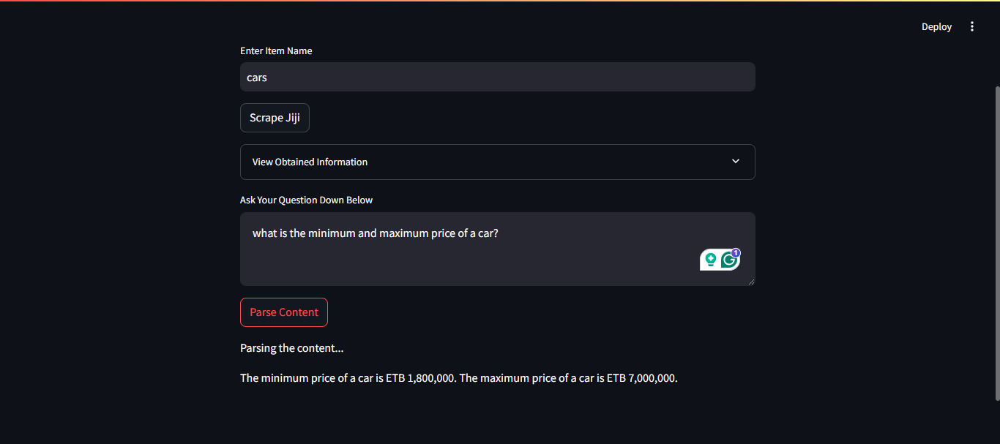
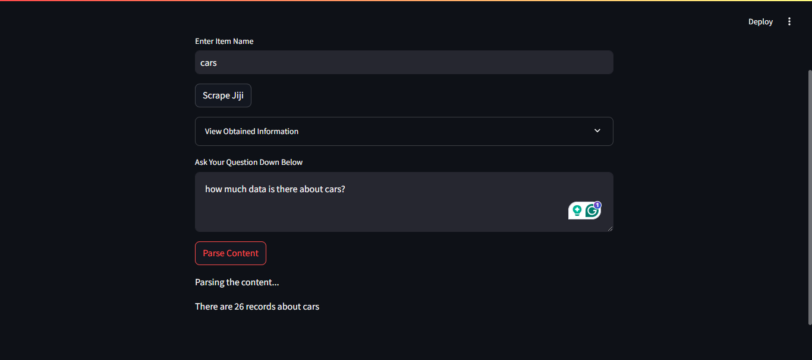
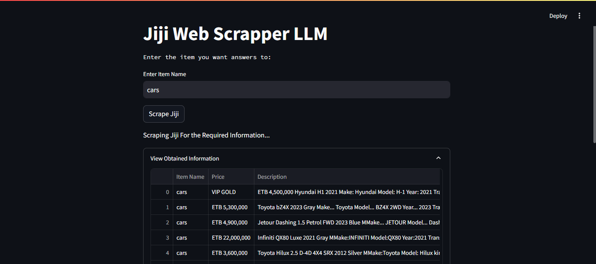

# RAG LLM for Ecommerce Site Jiji

## Project Overview

This project mainly focuses on providing various information and insights to customers who want to know more about the different items that are listed in the website. The project involves scrapping various data from jiji and using that as context to create a rag model that can be used by users to answer various prompt.

### Data

The data was collected using a webscraper that was made by selenium. It has some limitations like 
- Only provides Item title, description ,price and location of the product
- Doesn't provide all data provided for that certain item because a headless browser is used to extract the resource we can be resource-intensive.

The data contains the title, description, price and location information. This is saved to a csv file initally before preparing the embeddings. 

## Tools used

### Selenium
The main component used for the webscrapper is a browser automation. This requires the chromedriver to be setup and some limitations that had occured was some sites use scrapper prevention tool so for extra precaution we used selenium stealth. The scrapped data is saved to a csv file for later use.
### LangChain.
Langchain is an open-source framework designed to simplify the creation of applications using LLMs. The llm used for this case is Gemini but it was through langchain we were able to retrieve the various libraries used to create embeddings, ask various question and create a prompt template. We created various embeddings from the csv file created from the webscrapper to store to the vector database using langchain.

### Weaviate
Weaviate is a popular vector database that is used for many ai applications. We used the embedding converted by Langchain(Gemini) to create a collection and store the various vectors. This will be a huge resource to select the specific context we will send to langcain.

### Streamlit
Streamlit is an open-source framework designed to create beautiful web applications for data science and machine learning projects with minimal effort.This can aid us in recieveing the item name and the user's prompt for further processing.

## Getting Started

### Prerequistes
- Python 3.x
- Chrome WebDriver
- Selenium
- Langchain
- Weaviate

### Installation
#### 1. Clone the repository
```bash
git clone https://github.com/AlazarG19/RAG-LLM-Chatbot-For-Ethiopia-Ecommerce-Site-Jiji/
```

#### 2. Setup Virtual Environment
```bash
python3 -m venv venv 
```
or
```bash 
py -3.10 -m venv venv
``` 

(for 3.10 version. This is the version i used)

#### 3. Activate Virtual Environment

```bash 
source venv/bin/activate
```

#### 4. Install the required Python packages
```bash
pip install -r requirements.txt
```

- one issue you might encounter is even if streamlit installs correctly it will cause an error 
```
TypeError: WebSocketHandler.__init__() missing 2 required positional arguments: 'application' and 'request'
```
If you didn't encounter it skip it but if not to fix it Remove the line 214 (init part) of site-packages/tornado/web.py solves it. The problem occurs on windows

you can checkout the issue at 
https://github.com/streamlit/streamlit/issues/9140

#### 5. Navigate to Gemini and Retirive Your API key

In this step you'll have to obtain google's gemini api key inorder to allow different embeddings and processing of prompts.

#### 6. Setup the necessary Environmental Variables
create a .env and add 
- SCRAPPED_LOCATION="./scrapped_data"
- GOOGLE_API_KEY= your_google_api_key
- HOST=your_weaviate_host
- PORT=your_weaviate_port
- GRPC_PORT=your_weaviate_grpc_port

#### 7. Download and setup Chromedriver.
This step is essentail manily because selenium uses the chromedriver for creating a headless browser for browser automation. Download the chromedriver for your specific chrome version and put it in the scrapper folder. 

the currently chrome driver is for chrome version 
Version 130.0.6723.92 (Official Build) (64-bit) so if yours is like 
that no need to install another. If not replace it with your version

#### 8. Setup Weaviate DB
the current approach we used is to setup docker for this the steps include 
- Installing docker and docker-compose (if not available on your system)
- Create a docker-compose.yml file( already created and config has been setup)
- run 
```bash
docker-compose up
```

#### 9. Start the streamlit app.
You can start the whole program using the command 
```bash 
streamlit run main.py
```

## Processes Executed during the Whole Process
1. Scrapping data from Jiji using webscrapper
2. Saving data from Jiji to csv file
3. Connecting Weaviate DB using docker
4. Creating collection if it doesn't exist
5. Converting all file on the csv to a vector using gemini embeddings
6. Uploading all vectors by batch to weaviate
7. Accepting user query
8. Retrieving vector embedding for query
9. Retrieving most relevant information from prompt query
10. Returning final response

## Limitations
The first approach was to extract product name from query by spacy and bert but both model made a lot of mistake in extracting the keyword that will be an input for the webscrapper. 

Another limitaion was the obtained information is minimal since fetching detail of each object can consume a lot of time and resource.

## Demo


